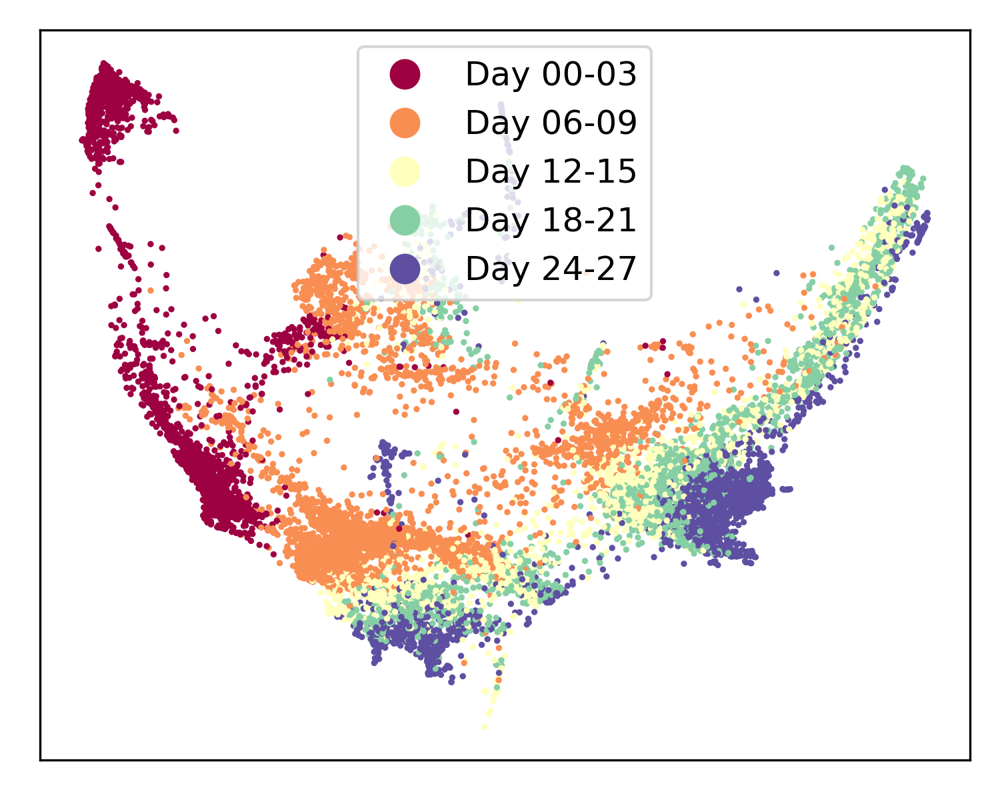
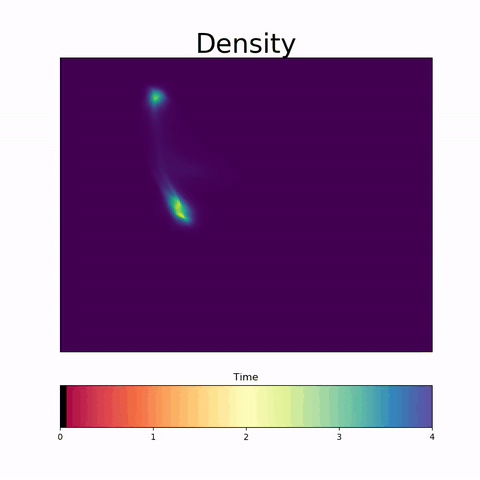

Pytorch Implementation of TrajectoryNet
=======================================

This library runs code associated with the TrajectoryNet paper [1].

Installation
------------

TrajectoryNet is available in `pypi`. Install by running the following

.. code-block:: bash

    pip install TrajectoryNet

This code was tested with python 3.7 and 3.8.

Example
-------

Basic Usage
-----------

Run with

.. code-block:: bash

    python -m TrajectoryNet.main --dataset SCURVE

To use a custom dataset expose the coordinates and timepoint information according to the example jupyter notebooks in the `/notebooks/` folder.

TrajectoryNet requires the following:

1. An embedding matrix titled `[embedding_name]` (Cells x Dimensions)
2. A sample labels array titled `sample_labels` (Cells)
3. (Optionally) a delta embedding representing RNA velocity titled `delta_[embedding_name]` (Cells x Dimensions)

To run TrajectoryNet with a custom dataset use:

.. code-block:: bash

    python -m TrajectoryNet.main --dataset [PATH_TO_NPZ_FILE] --embedding_name [EMBEDDING_NAME]
    python -m TrajectoryNet.eval --dataset [PATH_TO_NPZ_FILE] --embedding_name [EMBEDDING_NAME]

See `notebooks/EB-Eval.ipynb` for an example on how to use TrajectoryNet on a PCA embedding to get trajectories in the gene space.

References
----------
[1] Tong, A., Huang, J., Wolf, G., van Dijk, D., and Krishnaswamy, S. TrajectoryNet: A Dynamic Optimal Transport Network for Modeling Cellular Dynamics. In International Conference on Machine Learning, 2020. `arxiv <http://arxiv.org/abs/2002.04461>`_ `ICML <https://proceedings.icml.cc/paper/2020/hash/9d740bd0f36aaa312c8d504e28c42163>`_

---

If you found this library useful, please consider citing::

    @inproceedings{tong2020trajectorynet,
      title = {TrajectoryNet: A Dynamic Optimal Transport Network for Modeling Cellular Dynamics},
      shorttitle = {{{TrajectoryNet}}},
      booktitle = {Proceedings of the 37th International Conference on Machine Learning},
      author = {Tong, Alexander and Huang, Jessie and Wolf, Guy and {van Dijk}, David and Krishnaswamy, Smita},
      year = {2020}
    }
